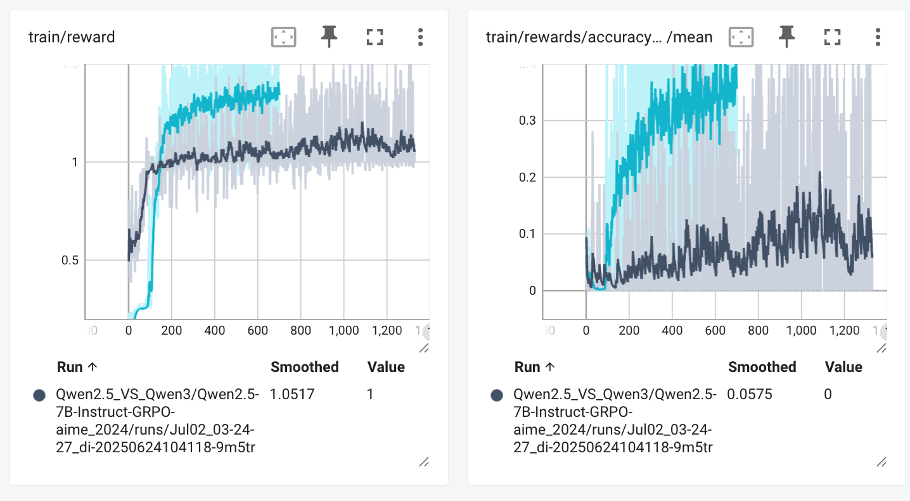

# dapo_reproduction
基于 TRL 的 DAPO 算法实现

[GitHub仓库](https://github.com/huggingface/open-r1)

## GRPO 与 DAPO

### 算法公式

 

  

### 算法差异

|                                                      | GRPO | DAPO |
| :--------------------------------------------------- | ---- | ---- |
| KL divergence                                        | ✅    | ❌    |
| clip_higher                                          | ❌    | ✅    |
| token_level_loss                                     | ❌    | ✅    |
| soft_overlong_punishment<br />(& overlong_filtering) | ❌    | ✅    |
| dynamic sample                                       | ❌    | ✅    |

DAPO 的 Table 1 展示了在 DeepSeek-R1-Zero-Qwen-32B 基础上逐步应用 DAPO 各项技术的效果：

| 模型/技术 | AIME24_avg@32 |
|----------|---------------|
| **DeepSeek-R1-Zero-Qwen-32B** | **47** |
| Naive GRPO | 30 |
| + Overlong Filtering | 36 |
| + Clip-Higher | 38 |
| + Soft Overlong Punishment | 41 |
| + Token-level Loss | 42 |
| **+ Dynamic Sampling (DAPO)** | **50** |

## DAPO 算法实现

代码实现目录：

基于 trl 的 DAPO 实现：`recipes/Qwen3-DAPO-Reproduction ` 

Deepspeed 配置：`recipes/accelerate_configs/zero3.yaml` 

本地下载脚本：`scripts/hf_download.py` huggingface

### Removing KL Divergence

#### 对应公式

 

#### 参考源码

 ``openr1/lib/python3.11/site-packages/trl/trainer/grpo_config.py`` : 

```python
beta: float = field(
    default=0.04,
    metadata={
        "help": "KL coefficient. If `0.0`, the reference model is not loaded, reducing memory usage and improving "
        "training speed, but may be numerically unstable for long training runs."
    },
)
```

#### 实现细节

在 ``recipes/config_Qwen3_DAPO.yaml`` 中，直接使用 ``trl/trainer/grpo_config.py`` 的 ``beta``

```yaml
# DAPO 实现关键配置
beta: 0.0
```

### Clip_Higher

#### 对应公式

  

#### 参考源码

 ``openr1/lib/python3.11/site-packages/trl/trainer/grpo_config.py`` : 

```python
epsilon: float = field(
    default=0.2,
    metadata={"help": "Epsilon value for clipping."},
)

epsilon_high: Optional[float] = field(
    default=None,
    metadata={
        "help": "Upper-bound epsilon value for clipping. If not specified, it defaults to the same value as the "
        "lower-bound specified in argument `epsilon`. Paper DAPO recommends `0.28`."
    },
)
```

#### 实现细节

在 ``recipes/config_Qwen3_DAPO.yaml`` 中，直接使用 ``trl/trainer/grpo_config.py`` 的 ``epsilon`` 和 ``epsilon_high``

```yaml
# DAPO 实现关键配置
epsilon: 0.2
epsilon_high: 0.28
```

### Token-Level Policy Gradient Loss

#### 对应公式

 

#### 参考源码

 ``openr1/lib/python3.11/site-packages/trl/trainer/grpo_config.py`` : 

```python
loss_type: str = field(
    default="bnpo",
    metadata={
        "help": "Specifies the loss formulation to use. Supported values are `grpo`, `bnpo`, and `dr_grpo`. "
        "`'grpo'`: Aggregates token-level losses by normalizing over sequence length. Not recommended due to "
        "length bias—this approach tends to prefer shorter completions with positive advantages and longer ones "
        "with negative advantages. "
        "`'bnpo'`: Aggregates token-level losses by normalizing number of active token in the local batch. "
        "Note that normalization is performed over the local batch only, so results may slightly vary depending "
        "on the local batch size, despite a constant effective batch size. When using "
        "`per_device_train_batch_size==1`, the loss is equivalent to the GRPO loss. "
        "`'dr_grpo'`: Aggregates token-level losses by normalizing with a global constant. This method was "
        "introduced in the Dr. GRPO paper to eliminate length bias. The value of the constant corresponds to "
        "`max_completion_length`."
    },
)
```

**DAPO 原始公式 (token级规范化):**

$$\mathcal{J}_{\text{DAPO}}(\theta) = \mathbb{E}_{(q,a)\sim\mathcal{D}, \{o_i\}_{i=1}^G \sim \pi_{\theta_{\text{old}}}(\cdot|q)} \left[ \frac{1}{\sum_{i=1}^G |o_i|} \sum_{i=1}^G \sum_{t=1}^{|o_i|} \min \left( r_{i,t}(\theta) \hat{A}_{i,t}, \text{clip}(r_{i,t}(\theta), 1-\varepsilon_{\text{low}}, 1+\varepsilon_{\text{high}}) \hat{A}_{i,t} \right) \right]$$

**BNPO/GRPO 实际实现 (序列级规范化):**

$$\mathcal{J}_{\text{BNPO}}(\theta) = \mathbb{E}_{(q,a)\sim\mathcal{D}, \{o_i\}_{i=1}^G \sim \pi_{\theta_{\text{old}}}(\cdot|q)} \left[ \frac{1}{G} \sum_{i=1}^G \frac{1}{|o_i|} \sum_{t=1}^{|o_i|} \min \left( r_{i,t}(\theta) \hat{A}_{i,t}, \text{clip}(r_{i,t}(\theta), 1-\varepsilon_{\text{low}}, 1+\varepsilon_{\text{high}}) \hat{A}_{i,t} \right) \right]$$

**核心差异:**
- DAPO: 分母为 $\sum_{i=1}^G |o_i|$ (batch中所有token总数)，token级权重相等
- BNPO/GRPO: 分母为 $G$ (batch中序列个数)，每个序列内部按长度平均，序列间权重相等

#### 实现细节

在 ``recipes/config_Qwen3_DAPO.yaml`` 中，直接使用 ``trl/trainer/grpo_config.py`` 的 ``loss_type`` 

```yaml
# 此处 bnpo 实际上依旧遵循 GRPO 的 loss 实现
loss_type: "bnpo"
```

### Overlong Filtering

#### 参考源码

 ``openr1/lib/python3.11/site-packages/trl/trainer/grpo_config.py`` : 

```python
mask_truncated_completions: bool = field(
    default=False,
    metadata={
        "help": "When enabled, truncated completions are excluded from the loss calculation, preventing them from "
        "being incorrectly penalized and introducing noise during training. According to the DAPO paper, this is "
        "a good practice for training stability."
    },
)
```

#### 实现细节

在 ``recipes/config_Qwen3_DAPO.yaml`` 中，直接使用 ``trl/trainer/grpo_config.py`` 的 ``beta``

```yaml
# DAPO 实现关键配置
mask_truncated_completions: true
```

### Soft Overlong Punishment

#### 对应公式

 

#### 实现细节

定义 ``soft_overlong_punishment_reward`` 作为 soft overlong punishment

```python
def get_soft_overlong_punishment(max_completion_len, soft_punish_cache):
    """
    Reward function that penalizes overlong completions. It is used to penalize overlong completions,
    but not to reward shorter completions. Reference: Eq. (13) from the DAPO paper (https://huggingface.co/papers/2503.14476)

    Args:
        max_completion_len: Maximum length of the completion
        soft_punish_cache: Minimum length of the completion. If set to 0, no minimum length is applied.
    """

    def soft_overlong_punishment_reward(completion_ids: list[list[int]], **kwargs) -> list[float]:
        """Reward function that penalizes overlong completions."""
        rewards = []
        for ids in completion_ids:
            completion_length = len(ids)
            if completion_length <= max_completion_len - soft_punish_cache:
                rewards.append(0.0)
            elif max_completion_len - soft_punish_cache < completion_length <= max_completion_len:
                rewards.append((max_completion_len - soft_punish_cache - completion_length) / soft_punish_cache)
            else:
                rewards.append(-1.0)
        return rewards

    return soft_overlong_punishment_reward
```

在 ``recipes/config_Qwen3_DAPO.yaml`` 中，直接使用 ``soft_overlong_punishment_reward`` 奖励函数

```yaml
reward_funcs:
- accuracy
- format
- tag_count
- soft_overlong_punishment # DAPO 实现关键配置
```

### Dynamic Sampling

#### 对应公式

 

#### 实现细节

todo

## DAPO 实验

实验结果目录：`result`

### device

GPU：A800 * 2

VRAM：81251MiB * 2

### datasets

- Training: [DAPO-Math-17k](https://huggingface.co/datasets/BytedTsinghua-SIA/DAPO-Math-17k), an elaborately curated math dataset.
- Validation: [AIME 2024](https://huggingface.co/datasets/BytedTsinghua-SIA/AIME-2024) dataset.

### base model

- Qwen3-0.6B
- Qwen3-8B

### ablation experiment

#### Qwen2.5 V.S. Qwen3

 

 

#### GRPO V.S. DAPO


## 参考资料

1. [dapo 官网](https://dapo-sia.github.io/) 
2. [grpo paper](https://arxiv.org/abs/2402.03300)
3. [dapo paper](https://arxiv.org/pdf/2503.14476)
1. [Hugging Face Open-R1](https://github.com/huggingface/open-r1)

